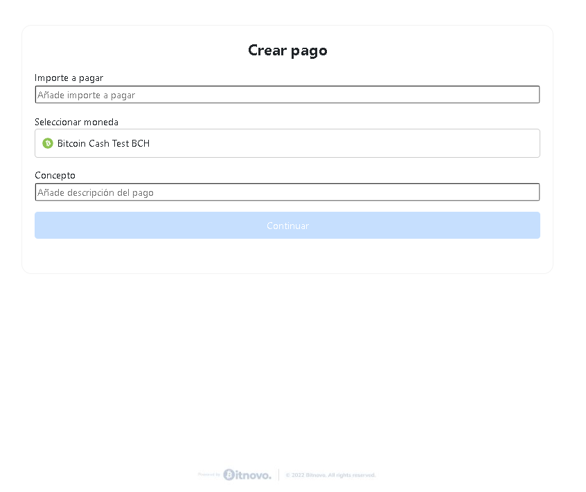
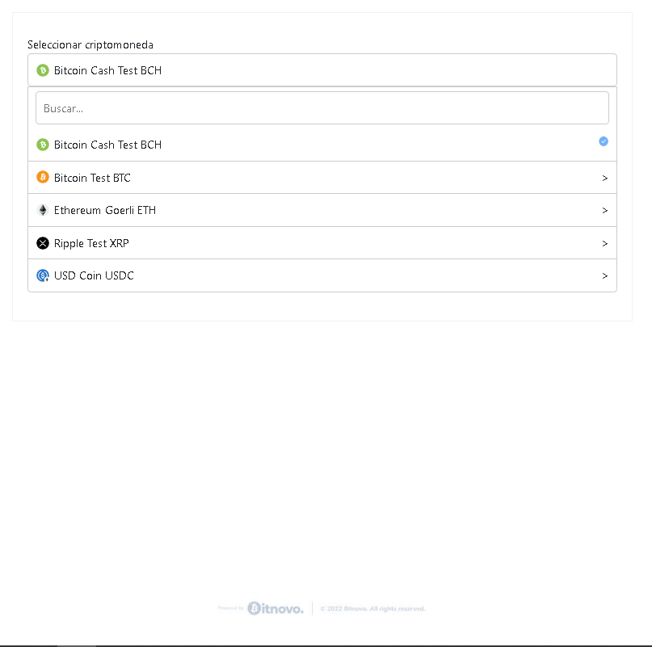
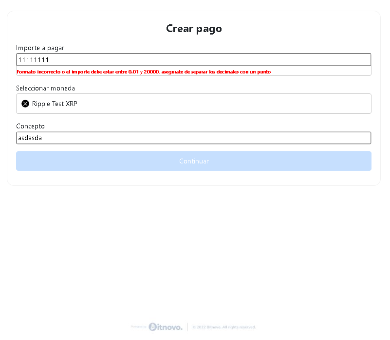
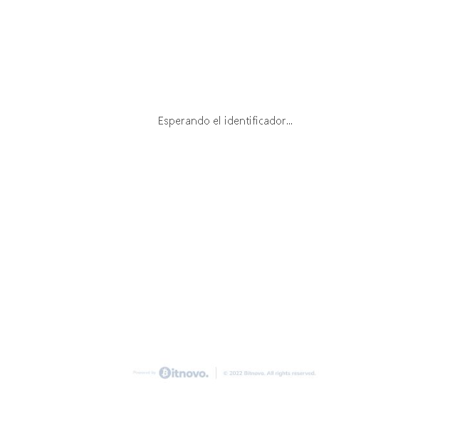
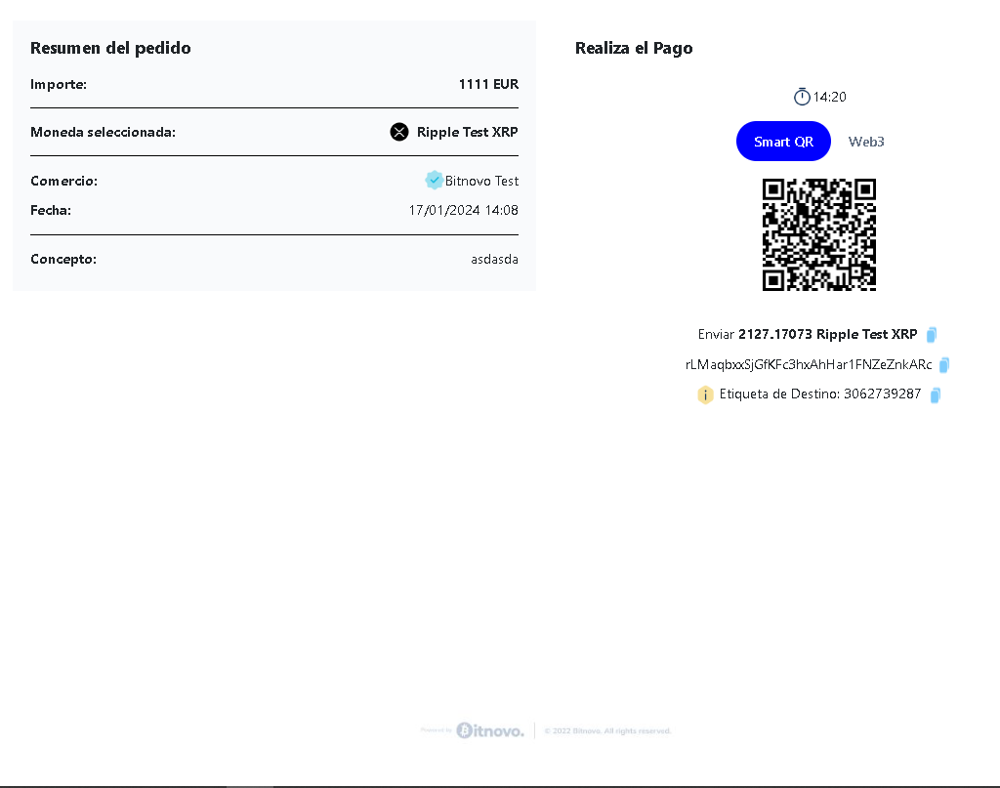
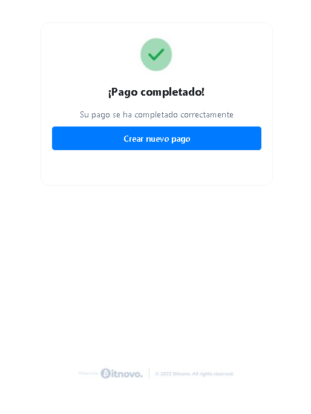
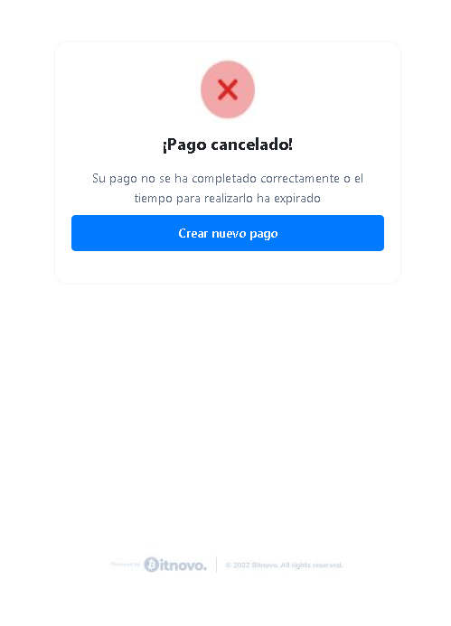

<h1 align="center"> Pasarelo de pagos Bitnovo</h1>
​​

Proyecto de creacion de pasarela de pagos en criptomonedas.
 
Desarrollada como prueba técnica.

​
​

​
​
<h5 align="center"> Tecnologías utilizadas</h1>
​

JavaScript, HTML5, CSS3, Bootstrap, React, Vite, GIT y GitHUB

  <tr >
    <td valign="top"></td>
    <td valign="top"></td>
    <td valign="top"></td>
    <td></td>
     <td valign="top"></td>
      <td valign="top"></td>
      <td valign="top"></td>
      <td valign="top"></td>
      <td valign="top"></td>
  
  

## Tabla de contenidos

​

- [👩🏻‍💻 Descripción del proyecto]
- [🔍 Observaciones]
- [⚖️ Licencia y Copyright]
- [📚Instrucciones]
  ​
  ​

### Instrucciones
1. Clona este repositorio en tu máquina local usando el siguiente comando: `git clone [URL del repositorio]`.

2. Clona el reposito bitnovo, en tu máquina local usando el siguiente comando: `git clone [URL del repositorio]`.

3. Ejecuta el comando `cd pasarela-pagos` en la consola.

4. Ejecuta el comando `npm i` en la consola para realizar las instalaciones necesarias del proyecto.

5. Ejecuta el comando `npm run dev` en la consola de este proyecto para levantar el servidor frontend.

### Descripción

​
Proyecto desarrollado para la prueba técnica de Bitnovo, consiste en una pasarela de pagos.

Consta de las siguientes funcionalidades.

Creación de pagos.

Muestra toda la información del pago y proporciona los campos necesarios para realizarlo.

Conectar con tu Metamask.

## Aqui las diferentes vistas del juego:

###### Creación del pago:

###### Seleccion criptomoneda

###### Crear pago con error

Vista si existe algun error en los datos.

###### Vista de carga

Vista de carga mientras recibimos la respuesta de la API.

###### Información del pago

###### Información del pago Web3

###### Pago realizado con existo

###### Pago no realizado con exito

### Observaciones

- ��Ha sido una prueba con distintos retos, aun con todas las ayudas al alcance, Stack overflow, youtube...han sido unos dias de mucha investigación y aprendizaje, al menos espero que os guste :).  
- ��Me hubiera gusta poder llegar a conseguir realizar los pagos
mediante el escaneo del QR y con la wallet Metamask, sin tener que introducir los datos manualmente.

 

### Cambios pendientes

- ��Mejorar el responsive.
- ��Modificar el background cuando seleccionas una opcion que el navegador recuerda.
- ��Pulir los estilos porque hay muchos repetidos y que no se aplican.
- ��Añadir funcionalidad para que se puedan hacer los pagos de forma automatica con el QR, y con Metamask a falta de la confirmación del usuario.

### Agradecimientos

A toda esos heroes anonimos que suben trocitos de codigo a internet y hace la vida mucho mas facil a los estudiantes.
​
​

### Licencia y copyright

📝 La licencia utilizada es una MIT License.
Este proyecto ha sido realizado pixel a pixel por mi, para completar la prueba técnica.
